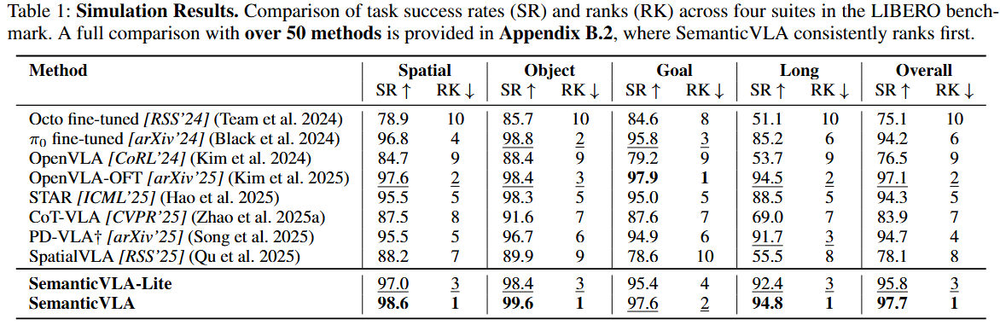
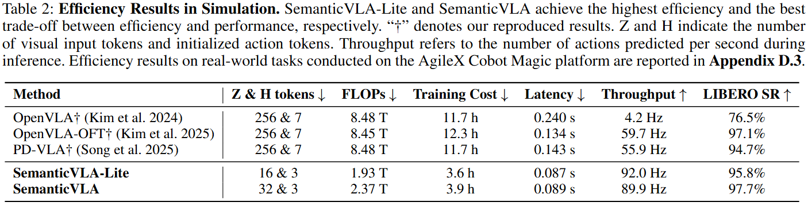

<div align="center">

<!-- <h1>JiuTian (九天) </h1> -->

<h2 class="papername"> SemanticVLA: Semantic-Aligned Sparsification and Enhancement for Efficient Robotic Manipulation<br>AAAI 2026 <span style="color:#C00000;">Oral</span></h2>
<div>
<div>
    <a href="https://orcid.org/0009-0007-7675-3550" target="_blank">Wei Li</a><sup>1</sup>,
    <a href="https://scholar.google.com/citations?user=iMJYtvwAAAAJ" target="_blank">Renshan Zhang</a><sup>1</sup>,
    <a href="https://rshaojimmy.github.io/OrionLab/" target="_blank">Rui Shao</a><sup>1†</sup>,
    <a href="/" target="_blank">Zhijian Fang</a><sup>1</sup>,
    <a href="https://jnhujnhu.github.io/" target="_blank">Kaiwen Zhou</a><sup>2</sup>,
    <a href="https://scholar.google.com/citations?user=mEjhz-IAAAAJ&hl=zh-TW" target="_blank">Zhuotao Tian</a><sup>1</sup>,
    <a href="https://liqiangnie.github.io/index.html" target="_blank">Liqiang Nie</a><sup>1</sup>
</div>
<sup>1</sup>Harbin Institute of Technology, Shenzhen<br>
<sup>2</sup>Huawei Noah's Ark Lab<br>
†Corresponding author


[](https://arxiv.org/abs/2511.10518)

<h3 align="center">
<strong>
🔥SemanticVLA is accepted to AAAI 2026 <span style="color:#C00000;">Oral</span>!🔥
<br>
⭐ Give us a star if you like it! ⭐
<br>
✨If you find this work useful for your research, please kindly cite our paper.✨
</strong>
</h3>


</div>
</div>


## :fire: Updates
- [11/2025] :fire: [arXiv paper](https://arxiv.org/abs/2511.10518) realeased!
- [11/2025] :fire: SemanticVLA is accepted to **AAAI 2026 Oral**!

## Introduction

This is the github repository of *SemanticVLA: Semantic-Aligned Sparsification and Enhancement for Efficient Robotic Manipulation*. 

SemanticVLA hinges on three-level complementary semantics (**Vision**-level spatial semantics, instruction-level **Linguistic** intent semantics, and control-level **Action** semantics) to perform Semantic-Aligned Sparsification and Enhancement for efficient and interpretable robotic manipulation. 

Extensive experiments demonstrate that SemanticVLA achieves state-of-the-art performance, attaining a 97.7% success rate on LIBERO, while reducing training costs by 3.0× and inference latency by 2.7× compared to OpenVLA.

The overall framework of SemanticVLA is illustrated below.

<div align="center">

</div>

## Experiments

**Performance.** SemanticVLA achieves state-of-the-art performance with success rates of 97.7\% and 77.8\% on simulation and real-world tasks, respectively.

<div align="center">

</div>

**Efficiency.** SemanticVLA also reduces training costs by 3.0× and decreases inference latency by 2.7× compared to OpenVLA.

<div align="center">

</div>

## Visualization

The attention maps of SemanticVLA highlight task-relevant regions in the input image, well aligning with human cognition during task execution.

<div align="center">

</div>

<div align="center">

</div>

## :fire: Citation

If you find this work useful for your research, please kindly cite our paper.

```
@inproceedings{li2025SemanticVLA,
  title={SemanticVLA: Semantic-Aligned Sparsification and Enhancement for Efficient Robotic Manipulation},
  author={Li, Wei and Zhang, Renshan and Shao, Rui and Fang, Zhijian and Zhou, Kaiwen and Tian, Zhuotao and Nie, Liqiang},
  booktitle={Proceedings of the AAAI Conference on Artificial Intelligence},
  year={2025}
}
```


